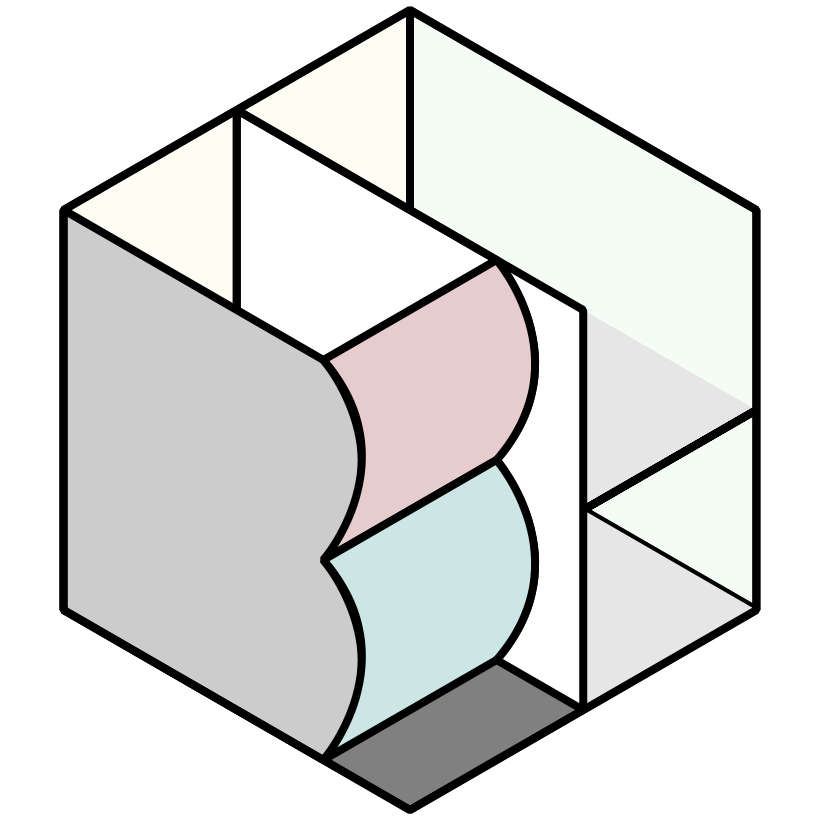

# BH23 Call for Participation

## How to participate to BH23

In this year, we start a new participation scheme to accelerate collaboration among the groups in the BioHackathon. To make the event more collaborative for all participants within a short time period, we decided to limit the number of hacking topics selected from the given list instead of calling for proposals as in the previous years. It is also because that the BioHackathon in Japan is an event hosted by the Database Center for Life Science (DBCLS), we prioritize research topics that focus on the integrated use of databases in life sciences. All those who aim to join the event will be asked to select "Research interests" and "Technical aspects" from the lists to declare how they can contribute and collaborate with other participants.

The selected participants will be offered any of the following: (A) full financial support, including travel and accommodation; (B) partial financial support, accommodation at the hackathon venue; and (C) invitation to participate (no financial support). Every participant, regardless of their role or type of participation, is required to submit a hacking plan. Only those who are selected by the plan or directly invited by the organizers are allowed to participate in the event.

### Research interest

- [R1] Multi-omics analysis on human genotype to phenotype that includes genomic, transcriptomic, epigenomic, proteomic, protein structures, and biochemical data.
- [R2] Automated data analysis of microorganisms including phylogenetic compositions, gene annotations, pathways, and growth conditions.
- [R3] Data-driven interdisciplinary studies in public health, environment, agriculture, food, energy, and other fields.
- [R4] Facilitating knowledge discovery and biological analysis of knowledge graphs and literature.

### Technical aspects

- [T1] Data
- [T2] Algorithm
- [T3] Analysis
- [T4] Tool
- [T5] Application
- [T6] Workflow

We ask you to write an abstract of your collaborative hacking plan with no more than 500 words. In your abstract, please describe how you contribute to the selected topic and collaborate with others by indicating "Research interest" and explain your expertise chosen from the "Technical aspects".

Submit your abstract from the BH23 [call for participation](https://docs.google.com/forms/d/e/1FAIpQLSfTd8X_QU49lcbJ0ZnqutnjJWhyccSnT5X94MRrqL5Qm56Dhg/viewform) form.

## Important dates

- Submission opens: 14th March, 2023
- Submission deadline:
  - w/ Travel support or who requires visa support: 31st March, 2023
  - w/o travel support: 30th April, 2023
- Selected proposals announcement: Early May, TBA
- BH23: 25th June - 1st July, 2023

## FAQ

- You ask. We answer.

