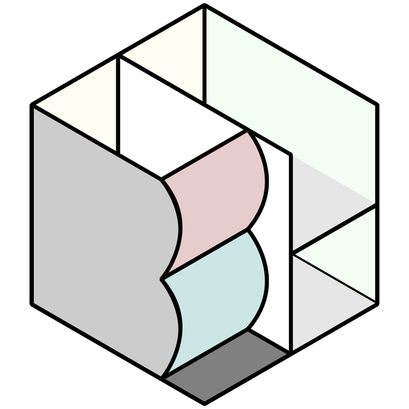

# DBCLS BioHackathon 2024

## Objectives

### Accelerate data science through the integrated use of databases in life sciences.

The BioHackathon in Japan, hosted by the Database Center for Life Science (DBCLS), prioritizes research topics that focus on the integrated use of databases in life sciences. Our focus is continuously on the standardization and interoperability of life sciences and biomedical databases (knowledge graphs). Simultaneously, by combining innovative approaches with information from literature, we aim to enable new discoveries through the development of methods and applications in data science.

To make the BioHackathon event more collaborative for all participants within a short time period, we have decided to limit the number of hacking topics. Having too many projects would limit interaction between them, so we will mainly focus on the following areas of research interest:

* [R1] Multi-omics analysis on human genotype to phenotype that includes genomic, transcriptomic, epigenomic, proteomic, protein structures, and biochemical data.
* [R2] Automated data analysis of other organisms including phylogenetic compositions, gene annotations, pathways, and growth conditions.
* [R3] Data-driven interdisciplinary studies in public health, environment, agriculture, food, energy, and other fields utilizing knowledge graphs.
* [R4] Facilitating knowledge discovery and biological analysis from databases and literature, especially utilizing large language models.

## Dates and venue

- Dates: 25th August (Sun) - 31st August (Sat), 2024
- Venue:
  - [YUMORI](https://yumori-hostel.jp/en/access/) and [Sansuiso](https://www.sansuiso.jp/en/) in Fukushima, Japan

## Important dates

- June 10, 2024: Registration opens
- July 26, 2024: Due date for payment (accommodation fees)

Note: Registration may be restricted if the number of participants exceeds the capacity.

## Information

- [Schedule](https://github.com/dbcls/bh24/wiki/Schedule)
- [Projects](https://github.com/dbcls/bh24/wiki/Projects)
- [Participants](https://github.com/dbcls/bh24/wiki/Participants)

## Links

- [DBCLS](https://dbcls.rois.ac.jp/)
- [Past BioHackathons](http://biohackathon.org/)
- [BioHackathon Europe](https://biohackathon-europe.org/)
- [BioHackathon-MENA](https://github.com/biohackathon-mena)
- [BioHackathons in the US](https://biohackathons.github.io/)

<!--
## History of BioHackathon

A long time ago in a galaxy far, far away..

See [biohackathon.org](http://biohackathon.org/).
-->
